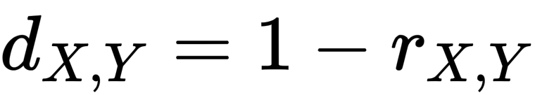
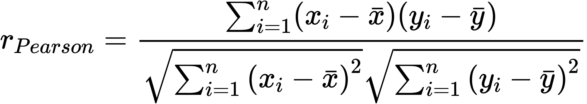

# STROTSS

See the original code and links to paper at https://github.com/nkolkin13/STROTSS

See the forked version we've based ourselves on at https://github.com/futscdav/strotss

We've created altered versions of the stross.py file with different distances for the content loss.

- In strossEuclidianDistance.py we've deleted the original cosine distance and used only the euclidian distance already defined, thus it doesn't the scale invariance needed for self similarity and the results are unsatisfactory.

- In stross.py we've used the cosine distance in the content loss, which is the original implementation. This version clearly mantains the scale invariance.

- In strossPearsonDistance.py we've used the pearson distance in the content loss. This version mantains the scale invariance and wields very similar results to the original implementation.

<p align="center">
  
</p>
<p align="center">
  
</p>

- In strossAngularPearsonDistance.py we've used the analogous angular formulation of the pearson distance in the content loss. This version still mantains the scale invariance and yields unconsistent results depending on the images used.

<p align="center">
  
</p>
<p align="center">
  
</p>

Usage:
```
python strotss{specify which}.py <content> <style> [--weight 1.0] [--output strotss.png] [--device "cuda:0"]
```
or if you want to use the scripts for batch processing:
```
python script{specify which}.py
```
the naming covention for the input images is:
```
content{3 digit number}.jpg
style{3 digit number}.png
```

<p align="center">
  
  
  
</p>
